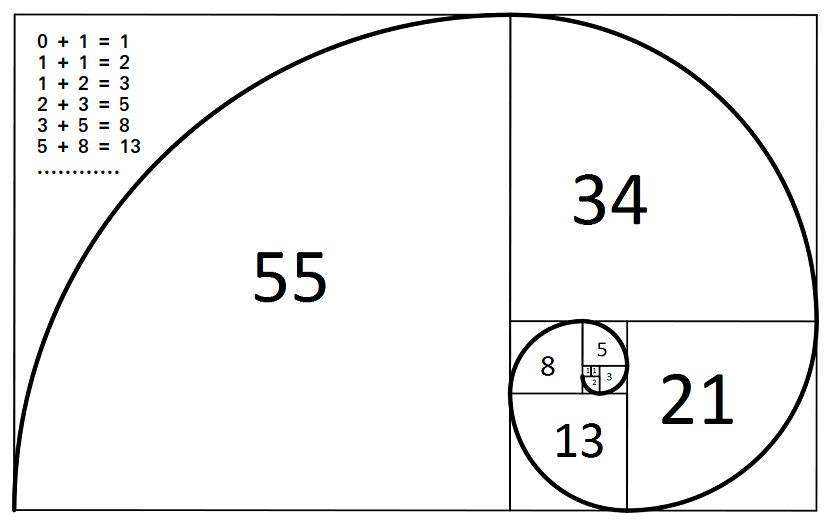

# 斐波那契数列( fibonacci )

列奥纳多在《计算之书》中提出一个在理想假设条件下兔子成长率的问题，并自行求解此问题。所求得的各代兔子的个数可形成一个数列，也就是斐波那契数。又称黄金分割数列、兔子数列。

斐波那契数的特点是每一个数都是前二个数的和。头二项是 0 和 1，此数列的前几项如下： 0, 1, 1, 2, 3, 5, 8, 13, 21, 34, 55, 89, 144, 233, 377, 610, 987 ...

随着斐波那契数的增加，相邻二项斐波那契数相除的商会接近黄金比例（近似值为 1 : 1.618 或 0.618 : 1）。

$$f(0)=0,f(1)=1,f(n)=f(n-1)+f(n-2)(n>=2)$$



## 递归实现

```js
function fib(n) {
  if (n < 2) {
    return n;
  }
  return fib(n - 1) + fib(n - 2);
}
```

这种方式很容易出现爆栈问题，而且这个函数不符合[尾调用优化条件](/javascript-professional/10.html#_10-13-尾调用优化)，因为返回语句中有相加的操作。内存复杂度为 `O(2^n)`。

## 迭代循环

```js
function fib(n) {
  if (n < 2) {
    return n;
  }

  let x = 0,
    y = 1,
    temp,
    i = 2; //t相当于一个临时变量 用于将后面一个数传到前面
  while (n >= i) {
    temp = y;
    y = x + y;
    x = temp;
    i++;
  }
  return y;
}
```

## 尾调用优化

不过，也可以保持递归实现，将其重构为满足优化条件的形式。为此使用两个嵌套函数，外部函数作为基础框架，内部函数执行递归函：

```js
"use strict";

// 框架函数
function fib(n) {
  return fibTmpl(0, 1, n);
}

// 执行递归
function fibTmpl(curr, next, n) {
  if (n === 0) {
    return curr;
  }
  return fibTmpl(next, curr + next, n - 1);
}
```

重构之后，就可以满足尾调用优化的所有的条件，再调用 `fib(1000)` 就不会对浏览器造成威胁了。
