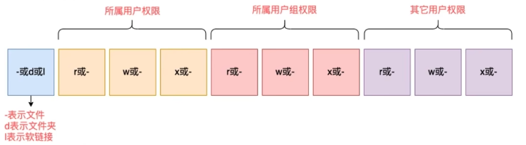

# Linux 权限管理

## 查看权限



- 文件类型，d：表示目录类型；l：表示软连接，`-`：表示文件；
- r：表示读权限；
- w: 表示写权限；
- x：表示执行权限；

## 修改权限 - chmod 命令

### 命令语法

`chmod [-R] 权限 文件/目录`

- `-R`，处理指定目录以及其子目录下的所有文件
- 权限设置使用 u（所有者）、g（所属组）、o （其他用户）代表 3 中身份；

### 使用数字修改文件权限

linux 系统中，文件的基本权限是由 9 个字符组成，如： rwxrw-r--，也可以使用数字代表各个权限，权限如下：

- r 数字用 4 表示；
- w 数字用 2 表示；
- x 数字用 1 表示；
- `-` 数字用 0 表示；

### 命令示例

```shell
## 修改文件
chmod u=rwx,g=rw,o=r log.txt

## 修改目录
chmod -R u=rwx,g=rw,o=r /temp/logs

## 数字表示
chmod 764 log.txt

chmod -R 764 /temp/logs
```

## 修改文件用户/用户组 - chown 命令

通过 chown 改变文件的拥有者和群组。在更改文件的所有者或所属群组时，可以使用用户名称和用户识别码设置。普通用户不能将自己的文件改变成其他的拥有者。其操作权限一般为管理员。

### 命令语法

`chown [-R] [所有者][:[组]] 文件/目录`

### 命令示例

```shell
## 将所属用户修改为 root
chown root log.txt

## 将所属用户组修改为 root
chown :root log.txt

## 将所属用户组、用户修改为 root
chown root:root log.txt
```
