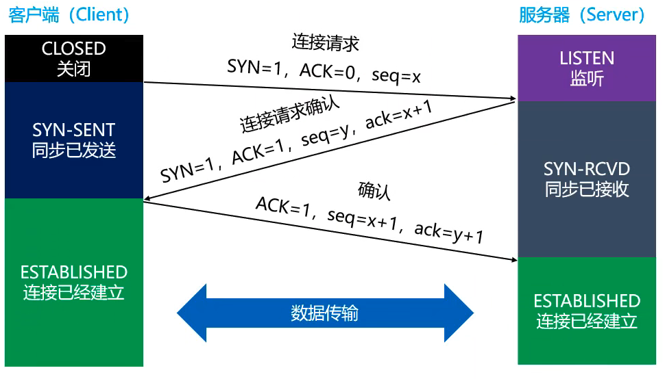
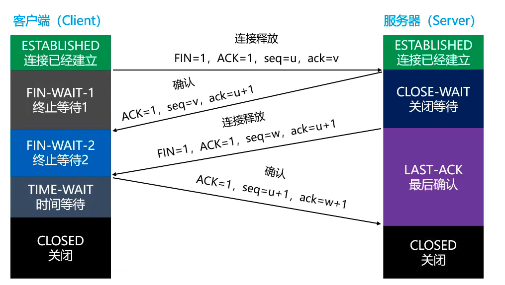
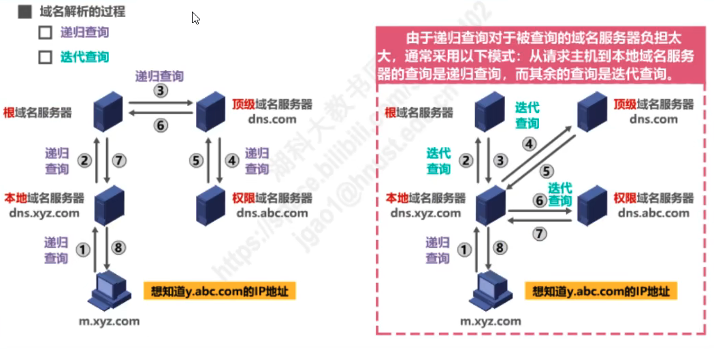
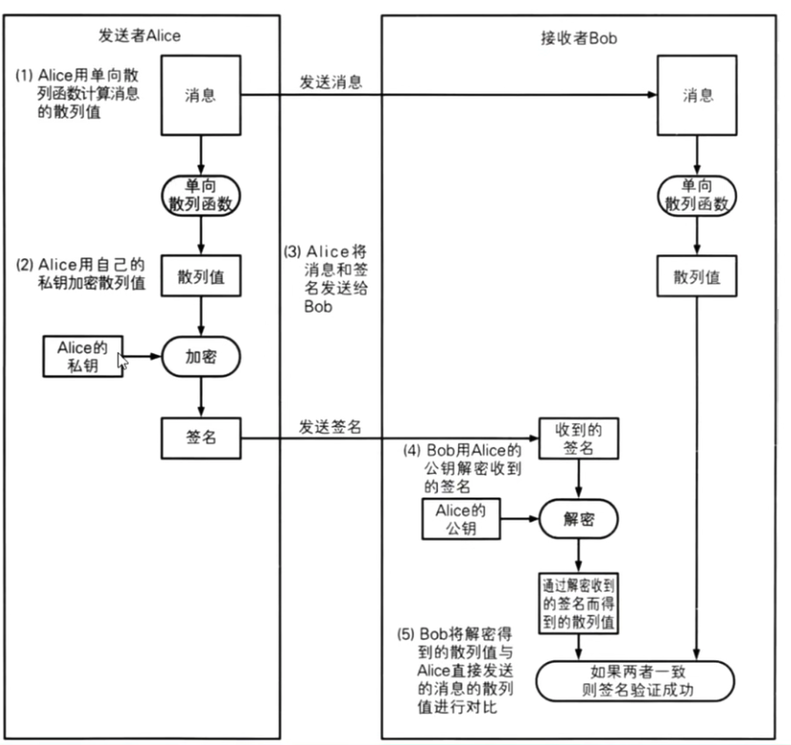
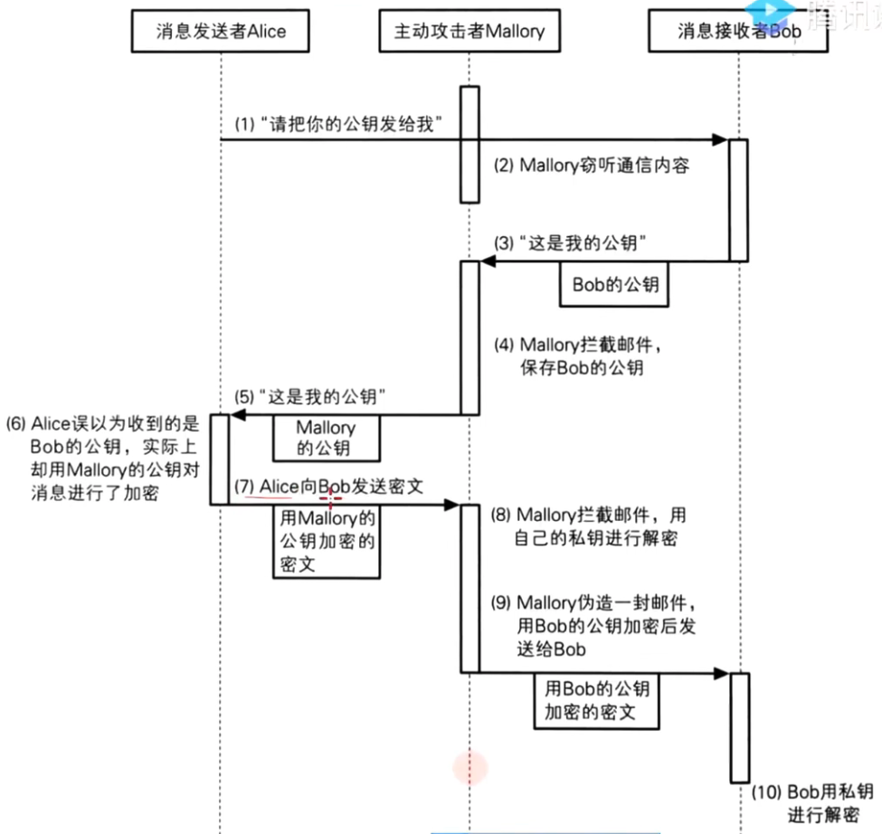

<!-- TODO 需要整理 -->

# 网络协议

网络协议的三要素

- 语义，解释控制信息每一个部分的意义；表示要做什么；
- 语法，用户数据域控制信息的结构与格式，以及数据出现的顺序；表示要怎么做；
- 时序，对事件发生的顺序的详细说明。表示做的顺序；

|                                  | 协议                          | 描述           |
| -------------------------------- | ----------------------------- | -------------- |
| 应用层（应用层、表示层、会话层） | FTP、HTTP(S)、SMTP、DNS、DHCP | 报文、用户数据 |
| 运输层                           | TCP、UDP                      | 段（Segments） |
| 网络层                           | IP、ARP、ICMP                 | 包（Packets）  |
| 数据链路层                       | CSMA/CD、PPP                  | 帧（Frames）   |
| 物理层                           |                               | 比特流（Bits） |

TCP/IP 协议：应用层、运输层、网际层、网络接口层

## 物理层

## 数据链路层

## 网络层

## 传输层

传输层有 2 个协议

|              | UDP                                  | TCP                                      |
| ------------ | ------------------------------------ | ---------------------------------------- |
| 连接性       | 无连接                               | 面向连接                                 |
| 可靠性       | 不可靠传输，尽最大努力交付，可能丢包 | 可靠传输，不丢包                         |
| 首部占用空间 | 小                                   | 大                                       |
| 传输速率     | 快                                   | 慢                                       |
| 资源消耗     | 小                                   | 大                                       |
| 应用场景     | 音视频通话，直播                     | 浏览器、文件传输、邮件发送               |
| 应用层协议   | DNS、DHCP、ARP                       | HTTP、HTTPS、FTP、SMTP、SSH、Telent、DNS |

### UDP 协议

UDP 协议：User Datagram Protocol，用户数据报协议；

- UDP 是无连接的，减少建立和释放连接的开销；
- UDP 仅最大能力交付，不保证可靠交付；
  - 因此不需要维护一些复杂的参数，首部只有 8 个字节（TCP 首部至少 20 个字节）
- UDP 长度：占 16 位，首部的长度+数据长度

### TCP 协议

​ TCP 协议：Transmission Control Protocol，传输控制协议；**TCP 是面向连接，可靠传输**

#### TCP-可靠传输

​ 确认重传

#### TCP-流量控制

- 为什么要流量控制？

  如果接收方对的缓存区满了或是空间不多，发送方还在疯狂发送数据。接收方只能把收到的数据包丢掉，大量丢包会浪费网络资源；

- 什么是流量控制？

  让发送方的发送的速率不要太快，让接收方来得及接收处理。

- 流量控制原理是什么？

  通过确认报文中窗口字段来控制发送方的发送速率；发送方的发送窗口大小不能超过接收方给出的窗口大小；

#### TCP-拥塞控制

- 拥塞过载目的：
  - 防止过多的数据注入到网络中；
  - 避免网络中的路由器或链路过载；
- 拥塞控制是全局性的过程；
  - 涉及到所有的主机、路由器；
  - 以及与降低网路传输性能有关的所有的因素；
  - 是全部共同的作用的结果；

相比而言，**流量控制是点对点通信的控制**。

拥塞控制的方法：

- 慢开始（slow start，慢启动）
- 拥塞避免（congestion avoidance）
- 快速重传（fast retransmit）
- 快速回复（fast recovery）

#### TCP-连接管理

##### TCP-三次握手



为什么建立连接时候要 3 次握手，2 次不行吗？

​ 主要目的：**防止 server 端一直等待，浪费资源；**

场景 1：如果建立连接只需要 2 次握手，可能会出现的情况：

- 假设 client 发出的第一个连接请求报文段，因为网络延迟，在连接释放以后的某个时间才到达 server；
- 本来这是一个早已失效的连接请求，但 server 收到此失效的请求后，误以为是 client 再次发出的一个新的连接请求；
- 于是 server 就向 client 发出确认报文段，同意建立连接；
- 如果不采用”3 次握手“，那么 server 发出确认，新的连接就建立了；
- 由于现在 client 并没有真正想连接服务器的意愿，因此不会回应 server 的确认或发送数据；

场景 2：第 3 次握手失败了，会怎么处理

- 此时 server 的状态为 SYN-RCVD，若等不到 client 的 ACK，server 会重新发送 SYN+ACK 包；
- 如果 server 多次重发 SYN+ACK 都等不到 client 的 ACK，就会发送 RST 包，强制关闭连接；

##### TCP-四次挥手

- TCP 是全双工模式
- 第一次挥手：当 Client 发送 FIN 报文段时
  - 表示 Client 告诉 Server，client 已经没有数据要发送了，但是此时 client 还是可以接受来自 server 的数据
- 第二次挥手，server 返回 ACK 报文段时
  - 表示 Server 已经确认 Client 没有数据发送，但是 Server 还是可以发送数据到 Client 的
- 第三次挥手，当 Server 也发送 FIN 报文段时
  - 表示 Server 告诉 Client，Server 已经没有数据发送了，
- 第四次挥手，当 Client 发挥 ACK 报文段时
  - 表示 Client 已经知道 Server 没有数据发送了，随后正式段开整个 TCP 连接



**状态说明：**

- FIN-WAIT-1：表示想主动关闭连接。
  - 向对方发送 FIN 报文，此时进入 FIN-WAIT-1 状态；
- CLOSE-WAIT：表示在等待关闭。
  - 当对方发送 FIN 给自己，自己会回应一个 ACK 报文给对方，此时进入 CLOSE-WAIT 状态；
  - 在此状态下，需要考虑自己是否还有数据要发送给对方，如果没有，发送 FIN 报文给对方（即：第二次和第三次可以合并）；
- FIN-WAIT-2：只要对方发送 ACK 确认后，主动方就会处于 FIN-WAIT-2 状态，然后等待对方发送 FIN 报文。
- CLOSING：一种比较罕见的例外状态。
  - 表示一端发送 FIN 报文后，并未收到对方的 ACK 报文，反而却收到对方的 FIN 报文。
  - 如果双方几乎同时准备关闭连接的话，那么就会出现双方同时发送 FIN 报文的情况，也会出现 CLOISING 状态；
  - 表示双方都正在关闭连接；
- LAST-ACK：被动关闭一方在发送 FIN 报文后，最后等待对方的 ACK 的报文；
  - 当收到 ACK 报文后，即可进入 CLOSED 状态；
- **TIME-WAIT：**表示收到对方的 FIN 报文，并发送出了 ACK 报文，就等 2MSL 后即可进入 CLOSED 状态了;

  - MSL（**Maximum Segment Lifetime，最大分段生存期，TCP 报文在 Internet 最长生存时间**），建议时 2 分钟，

  - 收到对方发送 ACK 后，需要进入 TIME-WAIT 阶段，等待一段时间，再进行真正关闭连接。
  - 如果收到对方发送的 ACK 后马上释放连接，随后由于网络原因，对方没有收到的 ACK，对方就会重发 FIN，就会出现以下情况：
    - client 没有任何响应，服务器会一直等待，甚至多次重发 FIN，浪费资源；
    - Client 有新的应用程序刚好分配到同一端口号，新的应用程序收到 FIN 后马上开始执行段开连接的操作，本来它可能是想建立连接的；
  - 目的：确保本次连接所有的数据包全部失效，防止本次连接中产生的数据包误传到下次连接中

- CLOSED：关闭

## 应用层

### 常见协议

- 超文本传输：HTTP、HTTPS
- 文件传输：FTP
- 电子邮件：SMTP、POP3、IMAP
- 动态主机配置：DHCP
- 域名系统：DNS

### DNS 协议

DNS （Domain Name System 的缩写），就是根据域名查出 IP 地址；工具软件 **dig** 可以显示整个查询过程

- 所有的 DNS 服务器都记录了根域名服务器的 IP 地址；
- 上级 DNS 服务器记录了下一级 DNS 服务器的 IP 地址；
- 全球一共**13 台**（名字分别为“A”至“M”）IPv4 的 DNS 根域名服务器，**25 台**IPV6 的 DNS 根域名服务器；



### DHCP 协议

#### 什么是 DHCP？

DHCP（Dynamic Host Configuration Protocol），动态主机配置协议；基于**UDP 协议**，客户端是**68 端口**，服务器是**67 端口**；
一般路由器可以充当 DHCP 服务器；

#### IP 地址如何分配？

1. DISCOVER：发现服务器
   - 发广播包（源 IP 是 0.0.0.0，目标 IP 是 255.255.255.255，目标 MAC 是 FF:FF:FF:FF:FF:FF）
2. OFFER：提供租约
   - 服务器返回可以租用的 IP 地址，以及租用期限、子网掩码、网关、DNS 等信息；
   - 这里可能会有多个服务器提供租约；
3. REQUEST：选择 IP 地址
   - 客户端选择一个 OFFER，发送广播包进行回应；
4. ACKNOWLEDGE：确认
   - 被选中的服务器发送 ACK 数据包给客户端；

#### 自动续约

客户端会在租期不足的时候，自动向 DHCP 服务器发送 REQUEST 信息申请续约；

### HTTP 超文本传输协议

HTTP--Hyper Text Transfer Protocol，超文本传输协议；
最初目的是：提供一种发布和接收 HTML 页面的方法，由 URI 来标示具体的资源；

#### HTTP 版本

- 1991 年，HTTP/0.9
  - 只支持 GET 请求，不支持请求头、响应头，无法向服务器传递太多信息；
- 1996 年，HTTP/1.0
  - 支持 POST、HEAD 等请求，支持请求头、响应头，支持更多种数据类型（不局限于文本数据）；
  - 浏览器的每次请求都要与服务器建立一个 TCP 连接，请求处理完成后立即断开 TCP 连接；
- 1997 年，HTTP/1.1
  - 支持 PUT、DELETE 等请求方式；
  - 采用持久连接（Connection: keep-alive），多个请求可以共用同一个 TCP 连接；
- 2015 年，HTTP/2.0

#### HTTP 标准-RFC

#### 报文格式-ABNF

```markdown
HTTP-message = start-line
\*(header-field CRLF)
CRLF
[meesage-body]
```

#### HTTP 请求方法

GET、POST、PUT、DELETE、HEAD、CONNECT、OPTIONS、TRACE

- HEAD：请求得到与 GET 请求相同的响应，但是没有响应体；
  - 在下载一个大文件前，先获取其大小，再决定是否要下载，节约带宽资源；
- OPTIONS：查看服务器支持哪些请求方法；
- TRACE：请求服务器回显收到请求信息，主要用于 HTTP 请求的测试或诊断；
- CONNECT：
  - 可以用于访问采用了 SSL 协议的站点；

#### HTTP 头部字段

| 字段名         | 说明                   | 示例                                                                                                                                      |
| :------------- | ---------------------- | ----------------------------------------------------------------------------------------------------------------------------------------- |
| User-Agent     | 浏览器的身份标识字符串 | Mozilla/5.0 (iPhone; CPU iPhone OS 10_3_1 like Mac OS X) AppleWebKit/603.1.30 (KHTML, like Gecko) Version/10.0 Mobile/14E304 Safari/602.1 |
| Host           |                        |                                                                                                                                           |
| Date           |                        |                                                                                                                                           |
| Referer        |                        | 应用：防盗链                                                                                                                              |
| Content-Type   |                        |                                                                                                                                           |
| Content-Length |                        |                                                                                                                                           |
|                |                        |                                                                                                                                           |
|                |                        |                                                                                                                                           |

#### HTTP 状态码

- 信息响应：100 ～ 199
- 成功响应：200 ～ 299
- 重定向：300 ～ 399
- 客户端错误：400 ～ 499
- 服务器错误：500 ～ 599

常见状态码

- 200：成功；
- 302：重定向；
- 304：读取缓存的内容；
- 400：Bad Request，语法无效（或参数不对，服务器定义 400），服务器无法解析改请求；
- 401：Unauthorized，未授权；
- 403：Forbidden，拒绝访问；
- 404：Not Found；未找到请求资源；
- 405：Method Not Allowed，服务器拒绝使用当前 Http 方法请求（**服务器能够处理**）；
- 406：Not Acceptable；服务器无法提供与 Accept-Chatset 以及 Accept-language 指定的值相匹配的响应；
- 408：Request Timeout，服务器想要将没有在使用的连接关闭；
- 500：Internal Server Error，服务器异常；
- 501：Not Implement，服务器不支持请求方法，无法处理（**服务器不支持**）；
  - 服务器必须支持的方法（不会返回 501 状态码）两种方法：GET、HEAD
- 502：Bad GateWay，作为网关或代理角色的服务器，从上游服务器（tomact）中接收到响应是无效的；
- 503：Service Unavailable，服务器尚未处于可以接受请求的状态；
  - 一般服务器是停机维护、超载状态；

#### 跨域 CORS

- 浏览器有个同源策略（Same-Orgin Policy）;
- 规定：默认情况下，AJax 请求只能发送给同源的 URL；
- 同源是指 3 个相同：协议、域名、端口；
- Img、script、link、iframe、video、audio 等标签不受同源策略约束；
- 服务器返回的响应头（Access-Controll-Allow-Orgin），告诉浏览器允许跨域访问的请求；

#### Cookie

- 默认情况下，cookie 数据保存在内存中，关闭浏览器后，cookie 数据销毁；
- 持久化存储（setMaxAge[int seconds]）
  - 正数：将 Cookie 数据写入硬盘文件中，持久化存储，并设置 Cookie 存活时间，时间到后，cookie 文件自动失效。
  - 负数：默认值，即关闭浏览器后，cookie 会失效；
  - 零：删除 Cookie 信息；

SetMaxAge 为正数时情况如下：

|                 | 重启浏览器        | 不关闭浏览器    |
| --------------- | ----------------- | --------------- |
| Cookie 时间未到 | 能访问到 Cookie   | 能访问到 Cookie |
| Cookie 时间到   | 不能访问到 Cookie | 能访问到 Cookie |

#### 代理服务器

|      | 正向代理                                                            | 反向代理                                   |
| ---- | ------------------------------------------------------------------- | ------------------------------------------ |
| 描述 | 代理的对象是客户端                                                  | 代理的对象是服务器                         |
| 作用 | 隐藏客户端身份<br />绕过防火墙<br />Internet 访问控制<br />数据过滤 | 隐藏服务器身份<br />安全防护<br />负载均衡 |

#### CDN 内容分发网络

### 网络安全

#### ARP 欺骗

#### DoS、DDoS

Dos 攻击：拒绝服务攻，Denial-of-Service attack；使目标电脑的网络或系统资源耗尽，使服务器暂时中断或停止，导致其正常用户无法访问；

DDos 攻击：分布式拒绝服务攻击，Distributed Denial-of-Service attack；使用网络上两个或以上被攻陷的电脑作为“僵尸”向特定目标发动 DoS 攻击（肉鸡）；

DoS 攻击分为两大类：

- 带宽消耗型：UDP 洪水攻击、ICMP 洪水攻击；
- 资源消耗型：SYN 洪水攻击、LAND 攻击；

#### 加密

常见加密方式：

- 不可逆

  - 单向散列函数，MD5、SHA 等

- 可逆

  - 对称加密：DES、3DES、AES（推荐）

    - 不安全、速度快

  - 非对称加密：RSA
    - 安全、速度慢

- 混合加密（HC）

- 数字签名

- 证书

#### 数字签名

数字签名解决的是什么？

- 确保消息的完整性；
- 防止数据篡改；
- 防止消息发送人否认；

> 数字签名的作用不是保证机密性，仅仅是保证内容有没有篡改。

数字签名主要过程

- 生成签名：由消息发送者完成，通过“签名密钥”生成；
- 验证签名：由消息接收者完成，通过“验证密钥”验证；

发送着使用**私钥进行签名加密**，接受者使用**公钥解密**；



#### 数字证书



#### HTTPS

HTTP 使用 SSL/TLS 来加密报文
