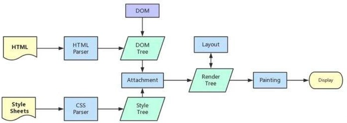

# 浏览器运行机制

了解进程和线程区别：

进程是系统资源分配的最小单位,系统为每个进程分配一块内存.一个应用程序可以包含多个进程, 进程之间可以通信,但是代价比较大;

一个进程可以包含多个线程， 每个进程中的内存空间对于里面的线程来说都是共享的，但是当某个线程在使用进程中的共享内存时，其他线程必须等他使用结束，才能操作该共享内存。防止多个线程同时读写某一块内存区域.

## 浏览器是多进程的

大致分为四类进程：

1. 主进程（Goole Chrome）

   也称为 Browser 进程，是浏览器的主控进程，只有一个.

   - 负责浏览器界面显示，与用户交互；如：前进、后退等；
   - 负责各个页面的管理，创建、销毁其他进程；
   - 将 Renderer 进程得到的内存中 Bitmap，绘制到用户界面上
   - 网络资源的管理、下载等

2. GPU 进程（GPU）

   图形处理器，负责 3D 图形的绘制，只有一个。

3. 渲染进程（Renderer）

   主要负责页面的渲染相关工作，有多个，默认每个 Tab 页一个进程。

4. 插件进程

   每一个插件都会创建一个插件进程，仅当使用该插件时才会创建。

## 浏览器中渲染进程

前端主要接触的**渲染进程**和**GPU 进程**，页面渲染、脚本执行、事件循环、接口请求等都是在渲染进程中，CSS3 中使用硬件加速则是在 GPU 进程中。

### 浏览器内核

浏览器内核是浏览器最重要的组成部分。浏览器内核分为两部分：**渲染引擎**和**JS 引擎**；随着 JS 引擎越来越独立，浏览器内核就倾向于单指渲染引擎。

渲染引擎主要用来解释网页语法并将网页渲染到屏幕上。由于不同浏览器使用不同的内核，导致对网页语法解释不同，所以出现最终渲染的效果不同。

常见浏览器内核：

| 浏览器类型 | 渲染引擎 | JS 引擎        |
| ---------- | -------- | -------------- |
| IE         | Trident  | Chakra         |
| Chrome     | BLink    | V8             |
| Safari     | webkit   | JavaScriptCore |

### 渲染进程（renderer）

浏览器的渲染进程（renderer）主要负责页面解析、JS 执行、事件循环处理等操作，renderer 进程是多线程的。主要线程包括：

#### GUI 渲染线程

Graphical User Interface，简称 GUI，又称图形用户界面。

负责将 html 解析成 DOM tree， 将 CSS 解析成 CSSOM tree，然后将二者整合生成 Render tree，进行布局（Flow Layout）和绘图（Paint）。

当 Render Tree 中部分或全部元素的尺寸、结构、或某些属性发生改变时，触发浏览器回流(Reflow), 或者当页面中元素样式的改变且不影响它在文档流中的位置时（例如：color、background-color、visibility 等），触发的浏览器重绘(Repaint)。

**GUI 渲染线程和 JS 引擎线程是互斥的。 二者不会同时发生。**

#### JS 引擎线程

负责解析、执行 JS 脚本代码。

在空闲时执行任务队列中进来的异步任务。

**每个 tab 页面只有一个 JS 引擎线程**, 而且与 GUI 线程互斥; 这是在这门语言设计之初就确立的规则,如果 JS 引擎线程在增删 DOM 的时,渲染线程执行渲染页面的操作, 那么此时渲染线程就凌乱, 不知咋办了;

#### 事件触发线程

浏览器为 JS 引擎线程开辟的助手，用于控制事件循环。

因为 JS 引擎是单线程运行的,对于一些耗时的异步任务,JS 引擎不能一直等待当前这些耗时操作(往往这些耗时操作并不是因为 JS 引擎运行速度慢、执行不过来导致的, 大多是由于网络请求、I/O 操作等外部原因导致的)处理完再执行后面的代码, 否则就太影响效率了, 所以对于一些像（定时器事件、鼠标事件， 滚动事件， AJX 事件），在事件触发时，事件触发线程会把回调任务添加到事件队列, 等待 JS 引擎线程来执行,我们经常说的事件循环机制(Event Loop)就发生在这个线程上。

#### 定时器线程

setInterval 和 setTimeout 事件所在的线程。

为了准确, 这些定时计数器是由单独的线程来维护的, 在定时结束时，将任务添加到事件队列, 等待 JS 引擎线程来执行。

#### HTTP 请求线程

当浏览器遇到 http 请求时，会开启一个 http 线程，待到状态变更时，将任务添加到事件队列，等待 JS 引擎线程来执行。

#### 任务队列轮询线程

用于轮询监听任务队列，以知道任务队列是否为空

## 页面渲染流程

用户在浏览器地址栏输入 URL 后（点击查看），浏览器获取内容后通过 RendererHost 接口转交给 Renderer 进程,渲染引擎拿到资源(html/js/css/img)后,开始解析渲染页面，其中大致会经历下面几个步骤:

1. **将 html 解析成 DOM Tree， 将 CSS 代码解析成 CSSOM Tree**

浏览器解析 HTML 的过程就是构建 DOM Tree 的过程,解析后的 DOM Tree 是同 HTML 文档中的节点应该是一一对应的. 而 dom 树的构建又是一个深度遍历的过程,只有当前节点的所有后代节点都遍历完成后,才会去处理当前节点的下一个兄弟节点.

CSSOM 包含了浏览器元素自带样式 user agent stylesheet 和所有我们自己编写的样式.这些构成了如何展示 DOM 的信息

2. **将 DOM Tree，和 CSSOM Tree 合并成渲染树 Render Tree**

渲染树包括了内容和样式：DOM 和 CSSOM 树结合为渲染树。为了构造渲染树，浏览器检查每个节点，从 DOM 树的根节点开始，并且决定哪些 CSS 规则被添加。

渲染树只包含了可见内容。头部（通常）不包含任何可见信息，因此不会被包含在渲染树种。如果有元素上有 display: none;，它本身和其后代都不会出现在渲染树中。

3. **布局(Flow Layout)**

根据 Render Tree 计算出各元素的排列位置、尺寸大小、从属关系等信息

第一次确定节点的大小和位置称为布局。随后对节点大小和位置的重新计算称为回流

4. **绘制(Paint)**

将带有样式信息的节点的每个可视部分绘制到屏幕上，包括文本、颜色、边框、背景、阴影.

绘制可以将布局树中的元素分解为多个层,例如某些特殊属性:opacity、transform 3D 等, 会使该元素通过 GPU 实例化一个层; 层可以提高绘制和重绘性能, 但是它以内存管理为代价，因此不应过度使用。

5. **合并图层(Composite)**

当文档的各个部分以不同的层绘制，相互重叠时，必须进行合成，以确保它们以正确的顺序绘制到屏幕上，并正确显示内容



## 预加载扫描器(preload scanner)

预加载扫描仪可以在解析前请求高优先级资源，如 CSS、Image、JavaScript 和 web 字体。使浏览器不必等到解析器解析到外部资源的引用的时候才向服务器请求。它将在后台请求资源，以便在主 HTML 解析器到达请求的资源时，资源可能已经在运行，或者已经被下载

```html
<link rel="stylesheet" src="style.css" />
<script src="./async.js" async></script>

<script src="./defer.js" defer></script>
```

在上面例子中，当主线程在解析 HTML 和 CSS 时，预加载扫描器会先找到脚本和图像，并开始下载它们。

## JavaScript 运行次序

[查看 async 和 defer 区别](/javascript/0001/async-defer.html)

## js 事件循环机制

js 是单线程的，但是会有同步任务和异步任务。

同步任务都是在主线程上执行的（**JS 引擎线程**），形成一个**执行栈**。

主线程之外，事件触发线程管理着一个任务队列，当异步任务触发并完成，事件触发线程将该异步任务（异步任务的回调），放置到任务队列；

只要当主线程执行完之后（执行栈清空），主线程就会读取任务队列中的事件，如果事件队列（消息队列）中有任务，主线程就会按照队列先进先出的原则，获取队列中的首位第一个任务并执行。

```js
(function () {
  console.log("1");

  setTimeout(function cb() {
    console.log("2");
  });

  console.log("3");

  setTimeout(function cb1() {
    console.log("4");
  }, 0);

  console.log("5");
})();

// 1, 3, 5, 2, 4
```

## 任务和微任务

JS 中的队列(queue)有我们常见的任务队列和微任务队列两种之分，

> 在 MDN 中对二者区别的解释:
>
> - 当执行来自任务队列中的任务时，在每一次新的事件循环开始迭代的时候运行时都会执行队列中的每个任务。在每次迭代开始之后加入到队列中的任务需要在下一次迭代开始之后才会被执行.
>
> - 每次当一个任务退出且执行上下文为空的时候，微任务队列中的每一个微任务会依次被执行。不同的是它会等到微任务队列为空才会停止执行——即使中途有微任务加入。换句话说，微任务可以添加新的微任务到队列中，并在下一个任务开始执行之前且当前事件循环结束之前执行完所有的微任务

```js
(function () {
  console.log("1");

  setTimeout(function cb() {
    console.log("2");
  });

  console.log("3");

  Promise.resolve().then(function cb() {
    console.log("4");
  });

  console.log("5");
})();
//1、3、5、4、2
```

## web 常见的浏览器内核比较

- Trident: IE 浏览器
- Gecko: Firefox 和 Flock
- Presto: Opera
- Webkit: Safari
- Blink: 谷歌

### Trident

这种浏览器内核是 IE 浏览器用的内核。

因为在早期 IE 占有大量的市场份额，所以这种内核比较流行。以前有很多网页也是根据这个内核的标准来编写的，但是实际上这个内核对真正的网页标准支持不是很好。

但是由于 IE 的高市场占有率，微软也很长时间没有更新 Trident 内核，就导致了 Trident 内核和 W3C 标准脱节。

还有就是 Trident 内核的大量 Bug 等安全问题没有得到解决，加上一些专家学者公开自己认为 IE 浏览器不安全的观点，使很多用户开始转向其他浏览器。

### Gecko

这是 Firefox 和 Flock 所采用的内核。

这个内核的优点就是功能强大、丰富，可以支持很多复杂网页效果和浏览器扩展接口，但是代价是也显而易见就是要消耗很多的资源，比如内存。

### Presto

Opera 曾经采用的就是 Presto 内核。

Presto 内核被称为公认的浏览网页速度最快的内核，这得益于它在开发时的天生优势，在处理 JS 脚本等脚本语言时，会比其他的内核快 3 倍左右，缺点就是为了达到很快的速度而丢掉了一部分网页兼容性。

### Webkit

Webkit 是 Safari 采用的内核。WebKit 前身是 KDE 小组的 KHTML 引擎，可以说 WebKit 是 KHTML 的一个开源的分支。

优点是：网页浏览速度较快，虽然不及 Presto 但是也胜于 Gecko 和 Trident；

缺点是：对于网页代码的容错性不高，也就是说对网页代码的兼容性较低，会使一些编写不标准的网页无法正确显示。

### Blink

谷歌在 Chromium Blog 上发表博客，称将与苹果的开源浏览器核心 Webkit 分道扬镳。

在 Chromium 项目中研发 Blink 渲染引擎（即浏览器核心），内置于 Chrome 浏览器之中。其实 Blink 引擎就是 Webkit 的一个分支，就像 webkit 是 KHTML 的分支一样。

Blink 引擎现在是谷歌公司与 Opera Software 共同研发，上面提到过的，Opera 弃用了自己的 Presto 内核，加入 Google 阵营，跟随谷歌一起研发 Blink。

参考文章：

- [一文看懂 Chrome 浏览器运行机制](https://zhuanlan.zhihu.com/p/102149546)
- [浏览器及其运行机制](https://juejin.cn/post/6943481814476390437)
- [浏览器运行机制](https://juejin.cn/post/6973946041691275271)
