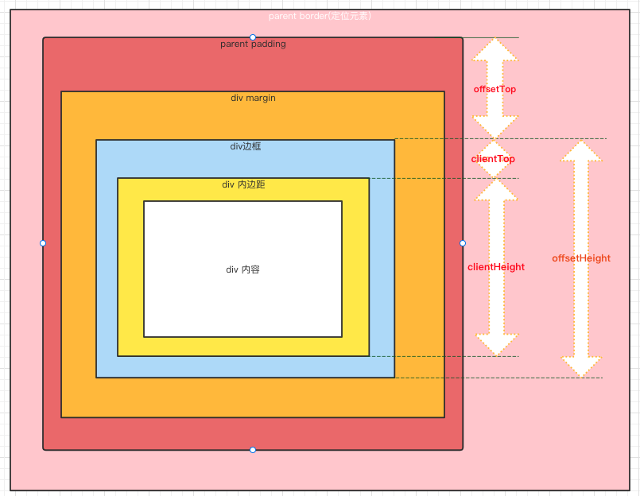

## DOM 常见的尺寸属性

| 属性         | 读写权限 | 描述                                                                                                                           |
| ------------ | -------- | ------------------------------------------------------------------------------------------------------------------------------ |
| offsetHeight | 只读     | 返回元素的像素高度，`offsetHeight = 垂直边框（border）+ 垂直内边距(padding) + 水平方向滚动条 + CSS height`。                   |
| offsetWidth  | 只读     | 返回一个元素的布局宽度，`offsetWidth = 水平边框（border）、水平内边距(padding) + 竖直方向滚动条 + CSS width`。                 |
| offsetParent | 只读     | 返回一个指向最近的（指包含层级上的最近）包含该元素的**定位元素**或者最近的 table, td, th, body 元素。                          |
| offsetLeft   | 只读     | 返回当前元素左上角相对于 `HTMLElement.offsetParent` 节点的左边界偏移的像素值；`offsetLeft = parent-left-padding + left-margin` |
| offsetTop    | 只读     | 返回当前元素左上角相对于 `HTMLElement.offsetParent` 节点的上边界偏移的像素值                                                   |
| clientHeight | 只读     | 对于没有定义 CSS 或者内联布局盒子的元素为 0；`clientHeight = CSS height + CSS padding - 水平滚动条高度（如果存在）`            |
| clientHeight | 只读     | 对于没有定义 CSS 或者内联布局盒子的元素为 0；`clientHeight = CSS width + CSS padding - 垂直滚动条高度（如果存在）`             |
| clientLeft   | 只读     | 表示一个元素的左边框的宽度。不包括顶部外边距或内边距                                                                           |
| clientTop    | 只读     | 一个元素顶部边框的宽度（以像素表示）。不包括顶部外边距或内边距                                                                 |

DOM 元素尺寸示例图：

## 鼠标尺寸属性

| 属性名    | 读写权限 | 描述                                                                                                                       |
| --------- | -------- | -------------------------------------------------------------------------------------------------------------------------- |
| screenX   | 只读     | 提供鼠标在全局（屏幕）中的水平坐标（偏移量）, 在多屏显示的环境下，水平对齐的屏幕将被视为单个设备                           |
| pageX     | 只读     | 返回的**相对于整个文档**的 x（水平）坐标以像素为单位；基于文档的边缘，**考虑任何页面的水平方向上的滚动**                   |
| clientX   | 只读     | **客户端区域**的水平坐标 (与页面坐标不同)；无论页面是否有水平滚动，点击客户端区域的左上角时，鼠标事件的 clientX 值都将为 0 |
| x         | 只读     | 实验中的功能, `MouseEvent.x `是 `MouseEvent.clientX` 属性的别名。                                                          |
| offsetX   | 只读     | 事件对象与目标节点的内填充边（padding edge）在 X 轴方向上的偏移量。                                                        |
| movementX | 只读     | 当前事件和上一个 mousemove 事件之间鼠标在水平方向上的移动值                                                                |
