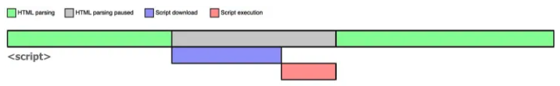
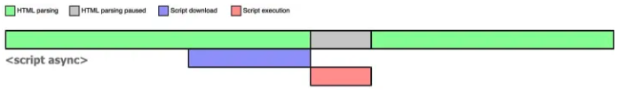
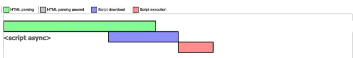
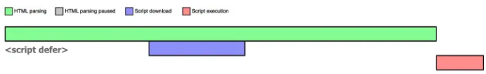
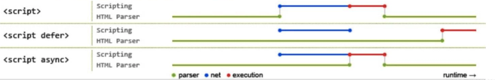

# async 和 defer 区别

在 HTML 中 script 标签遇到三类写法：

```html
<script src="xxx"></script>
<script src="xxx" async></script>
<script src="xxx" defer></script>
```

## script 默认属性

浏览器在解析 HTML 的时候，如果遇到没有任何属性的 script 标签，就会暂停解析，先发送网络请求获取 JS 脚本代码内容，然后让 JS 引擎执行该代码，当代码执行完毕后恢复解析。图示如下：



## script async

async 表示异步，例如七牛的源码中就有大量的 async 出现。

当浏览器遇到带有 async 属性的 script 时，会并行请求该脚本代码内容，不会阻塞浏览器解析 HTML，一旦网络请求完成，如果此时 HTML 还未解析完成，浏览器会暂停解析，先让 JS 引擎执行代码，执行完毕后再进行解析。图示如下：



如果在 JS 脚本请求回来后之前，HTML 已经解析完毕，立即执行 JS 代码。图示如下：



async 是**不可控的**，因为执行时间不确定。如果异步 JS 脚本中获取某个 DOM 元素，有可能获取到也可能获取不到，而且如果存在多个 async 时候，他们之间的**执行顺序也不确定，完全依赖网络传输结果**，谁先请求完成执行谁。

## script defer

defer 表示延迟，例如掘金的源码中就有大量的 defer 出现。

当浏览器遇到带有 defer 属性的 script 时，**获取该脚本的网络请求也是异步的，不会阻塞浏览器解析 HTML**，一旦网络请求回来之后，如果此时 HTML 还没有解析完，浏览器不会暂停解析，而是**等待 HTML 解析完毕再执行 JS 代码**，图示如下：



浏览器该脚本将在文档完成解析后，触发 DOMContentLoaded 事件前执行。有 defer 属性的脚本会阻止 DOMContentLoaded 事件，直到脚本被加载并且解析完成。

如果存在多个 defer script 标签，浏览器（IE9 及以下除外）**会保证他们按照 HTML 中出现的顺序执行**，不会破坏 JS 脚本之间的依赖关系。

## 总结

| script 标签      | JS 执行顺序      | 是否阻塞解析 HTML      |
| ---------------- | ---------------- | ---------------------- |
| `<sciprt>`       | 在 HTML 中的顺序 | 阻塞                   |
| `<sciprt async>` | 在 HTML 中的顺序 | 可能阻塞，也可能不阻塞 |
| `<sciprt defer>` | 在 HTML 中的顺序 | 不阻塞                 |

图示如下：


