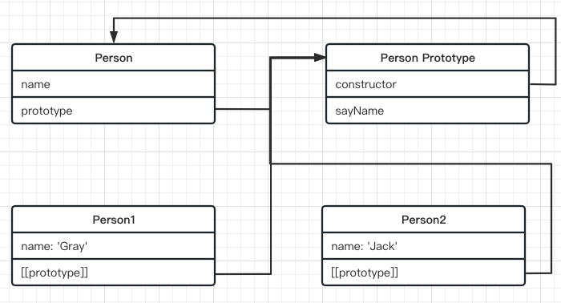
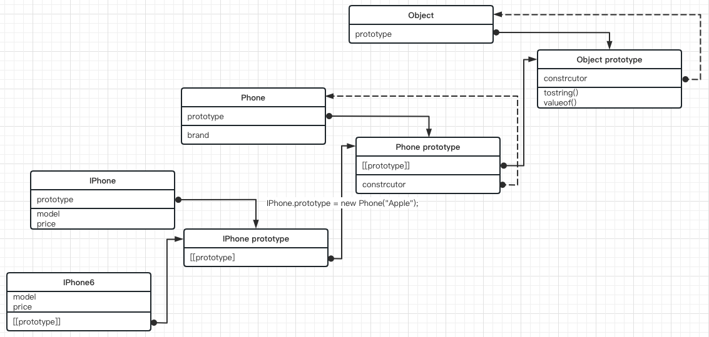

# 第八章 对象、类和面向对象编程

- 理解对象；
- 理解对象创建过程；
- 理解继承；
- 理解类；

## 8.1 理解对象

创建对象方式：`new` 关键词、字面量；

### 8.1.1 属性的类型

属性分两种：数据属性和访问器属性；

#### 数据属性

- `[[Configurable]]`：可配置，表示属性是否可以通过 `delete` 删除并重新定义，是否可以修改它的特性，以及是否可以把它改为访问器属性。
- `[[Enumerable]]`：可枚举，表示属性是否可以通过 `for..in` 循环返回。
- `[[Writable]]`：可修改，表示属性的值是否可以被修改。
- `[[value]]`: 包含属性的实际值。默认值：`undefined`。

通过 `Object.defineProperty()` 方法，该方法接收三个参数：添加属性的对象，属性的名称，一个描述符对象。

```javascript
let person = {};

Object.defineProperty(person, "name", {
  writable: false,
  value: "Nicholas",
});
console.log(person.name); // Nicholas
person.name = "Greg";
console.log(person.name); // Nicholas
```

1. `writable: false`，非严格模式下，尝试给这个属性重新赋值会被忽略，在严格模式下，尝试修改只读属性的值会排出错误；

2. `configurable: false`，非严格模式下，对这个属性调用 `delete` 没有效果，严格模式下会抛出错误；此外，属性定义为不可配置之后，就不能变回可配置了，再次调用 `Object.defineProperty()` 并修改任何非 `writable` 属性会导致错误；

```js
let person = {};
Object.defineProperty(person, `name`, {
  configurable: false,
  value: "Nicholas",
});

// 排出错误
Object.defineProperty(person, `name`, {
  configurable: true,
  value: "Nicholas",
});
```

3. 可以同时一个属性多次调用 `Object.defineProperty()`，但是 `configurable: false` 之后就会受限制；

```js
let person = {};

Object.defineProperty(person, `name`, {
  configurable: true,
  writable: true,
  value: "Nicholas",
});
Object.getOwnPropertyDescriptor(person, "name"); // {value: 'Nicholas', writable: true, enumerable: false, configurable: true}

Object.defineProperty(person, `name`, {
  configurable: false,
  writable: true,
  enumerable: true,
  value: "Nicholas",
});
Object.getOwnPropertyDescriptor(person, "name"); // {value: 'Nicholas', writable: true, enumerable: true, configurable: false}
```

4. 在调用 `Object.defineProperty()` 时，configurable、enumerable、writable 的值不设置，则默认是 false；

```javascript
let person = {};

Object.defineProperty(person, `name`, {
  value: "Nicholas",
});
Object.getOwnPropertyDescriptor(person, "name"); // {value: 'Nicholas', writable: false, enumerable: false, configurable: false}
```

#### 访问器属性

访问器属性有 4 个特性描述它们的行为：

- `[[Configurable]]`：可配置，表示属性是否可以通过 `delete` 删除并重新定义，是否可以修改它的特性，以及是否可以把它改为访问器属性。
- `[[Enumerable]]`：可枚举，表示属性是否可以通过 `for..in` 循环返回。
- `[[Get]]`：获取函数，在读取属性时调用。
- `[[Set]]`：设置函数，在写入属性时调用。

### 8.1.2 定义多个属性

`Object.defineProperties()` 方法可以通过多个描述符一次性定义多个属性。它接收两个参数：修改/添加的对象、描述符对象，其属性和要添加或修改的属性一一对应。

```js
let person = {};

Object.defineProperties(person, {
  name: {
    configurable: true,
    writable: true,
    enumerable: true,
    value: "Jonb",
  },
  age: {
    configurable: true,
    writable: true,
    enumerable: true,
    value: 18,
  },
});
// {name: 'Jonb', age: 18}
```

### 8.1.3 读取属性的特性

`Object.getOwnPropertyDescriptor()` 方法可以取得指定属性的属性描述符。

`Object.getOwnPropertyDescriptors()` ES2017 新增静态方法，用来获取一个对象的所有自身属性的描述符。

### 8.1.4 合并对象

- `Object.assign()`，方法将所有可枚举（Object.propertyIsEnumerable() 返回 true）的自有（Object.hasOwnProperty() 返回 true）属性从一个或多个源对象复制到目标对象，返回修改后的对象。

```js
const target = { a: 1, b: 2 };
const source = { b: 4, c: 5 };

const returnedTarget = Object.assign(target, source);
console.log(returnedTarget === target); // true
```

### 8.1.5 对象标识及相等判定

`Object.is()` 判断两个值是否为[同一个值](https://developer.mozilla.org/zh-CN/docs/Web/JavaScript/Equality_comparisons_and_sameness)。

- `Object.is()` 不会强制类型转换，即： `"" == false 是不成立的`；
- `Object.is()` 与 `===` 区别在于 对待符号 0 和 NaN 不同。`===` 运算符数字`-0`、`+0` 返回 true，NaN 对比是不相等；

### 8.1.6 增强的对象语法

#### 属性值简写

使用变量名会自动被解释为同名的属性键值，属性值就是变量值。

```js
const foo = "bar";
const baz = { foo };
baz; // {foo: "bar"}

// 等同于
const baz = { foo: foo };
```

#### 简写方法名

#### 属性名表达式

用表达式作为属性名，这时要将表达式放在方括号之内。表达式还可以用于定义方法名。

> 注意，属性名表达式如果是一个对象，默认情况下会自动将对象转为字符串`[object Object]`，这一点要特别小心。

### 8.1.7 对象解构

对象解构：就是使用与对象匹配的结构来实现对象属性赋值。

```js
const person = {
  name: "Matt",
  age: 18,
};
const { name: pname, age: page } = person;
console.log(pname, page); // 'Matt' 18
```

- 让变量直接使用属性的名称：

```js
const person = {
  name: "Matt",
  age: 18,
};
const { name, age } = person;
console.log(name, age); // 'Matt' 18
```

- 引用的属性不存在，则该变量的值为 undefined；

```js
const person = {
  name: "Matt",
  age: 18,
};
const { name, job } = person;
console.log(name, job); // 'Matt' undefined
```

- 解构赋值时可以定义默认值

```js
const person = {
  name: "Matt",
  age: 18,
};
const { name, job = "Software engineer" } = person;
console.log(name, job); // 'Matt' Software engineer
```

- 解构在内部使用函数 ToObject() 把源数据结构转换为对象。这意味着在对象解构的上下文中，原始值会被当成对象。所以 null 、undefined 不能被解构，会抛出错误。

```js
let { length } = "foobar";
console.log(length); // 8

let { constructor: c } = 4;
console.log(c === Number); // true
```

- 如果要将一个已经声明的变量用于解构赋值，必须非常小心。赋值表达式必须包含在一对括号中；

> 因为 JavaScript 引擎会将{x}理解成一个代码块，从而发生语法错误。只有不将大括号写在行首，避免 JavaScript 将其解释为代码块，才能解决这个问题。

```js
// 错误的写法
let x;
{x} = {x: 1};
// SyntaxError: syntax error

// 正确的写法
let x;
({x} = {x: 1});
```

- 嵌套解构

  解构对于引用嵌套的属性或赋值目标没有限制

- 部分解构

  涉及多个赋值，开始的赋值成功而后面的赋值失败，则整个解构赋值只会完成一部分；

- 参数上下文匹配

  函数参数列表中可以进行解构，对参数的解构赋值不会影响 arguments 对象。

## 8.2 创建对象

### 8.2.2 工厂模式

工厂模式用于抽象创建特定的对象的过程。

```js
function createPerson(name, age, job) {
  let o = new Object();
  o.name = name;
  o.age = age;
  o.job = job;
  return o;
}
const p1 = createPerson("Nich", 18, "Doctor");
```

> 这种工厂模式虽然可以解决创建多个类型对象的问题，但没有解决对象标识问题（即新创建的对象是什么类型）。

### 8.2.3 构造函数模式

构造函数是用于**创建特定类型对象的函数**，使用 new 调用构造函数会自动创建新对象。构造函数习惯使用大驼峰命名方式。

```js
function Person(name, age, job) {
  this.name = name;
  this.age = age;
  this.job = job;
  this.sayName = function () {
    console.log(this.name);
  };
}
Person.prototype.say = function () {
  console.log(this.name);
};
const p1 = new Person("Nich", 19, "Teacher");
```

> `constructor` 本来是用于标识对象类型的（即指向是构造函数）；但是一般使用 `instanceof` 操作符确定对象类型更可靠；

构造函数模式与工厂模式区别：

- 没有显式地创建对象；
- 属性和方法直接赋值给了 this；
- 没有 return；

#### :star: new 操作符具体干了什么：

1. 在内存创建一个空的对象；
2. 将构造函数的 prototype 对象赋值给新对象的原型（`[[Prototype]]`）;
3. 构造函数的 this 被赋值为这个新对象（即 this 指向新对象）；
4. 执行构造函数内部代码（给对象添加属性）；
5. 如果构造函数返回非空对象，则返回该对象，否则，返回刚创建的新对象；

#### 手写 new 操作符

```js
function myNew(Func, ...args) {
  const obj = {};
  obj.__proto__ = Func.prototype;
  let res = Func.apply(obj, args);
  return res instanceof Object ? res : obj;
}
```

#### 1. 构造函数也是函数

构造函数和普通函数唯一区别在**调用方式不同**。构造函数使用 `new` 操作符。

- 构造函数作为普通函数直接调用：针对函数没有明确设置 this 值的情况下（没有作为对象方法调用，也没有使用 `apply/call/bind` 调用），this 始终指向 Global（window）对象。
- 使用 `call/apply` 调用：将特定的对象指定为作用域，将改变构造函数 this 的指向；

```js
// 作为构造函数
let p1 = new Person("Nich", 19, "Engineer");
p1.sayName();

// 作为普通函数调用
let p2 = Person("Jone", 20, "Teacher"); // this 指向 window
window.sayName();

// 在另一个对象的作用域中调用
const p3 = new Object();
Person.call(p3, "Greg", 29, "Nurse");
p3.sayName();
```

#### 2. 构造函数的问题

### 8.2.4 原型模式

每一个函数都会创建一个 `prototype` 属性，这属性是一个对象，包含由特定引用类型的实例**共享的属性和方法**；

#### 1. 理解原型

- 默认情况下，原型对象中 constructor 属性，指回与之关联的构造函数；
- 实例对象内部 `[[Prototype]]` 指针会被赋值为构造函数的原型对象；
- 每个对象上暴露 `__proto__` 属性，通过这个属性可以访问对象的原型；
- 实例与构造函数原型之间有直接联系，但是实例和构造函数之间没有；



- `Object.prototype.isPrototypeOf()` 用于测试一个对象是否存在于另一个对象的原型链上。

语法：`prototypeObj.isPrototypeOf(object)`

> isPrototypeOf 和 instanceof 区别：在表达式 "object instanceof AFunction"中，object 的原型链是针对 AFunction.prototype 进行检查的，而不是针对 AFunction 本身。

```js
// 检测构造方法 Person 的原型对象是否在 实例对象P1 的原型链
Preson.prototype.isPrototypeOf(p1);

// 此时等同于
console.log(p1 instanceof Person); // true
```

- `Object.getPrototypeOf()`：返回指定对象的原型（内部`[[prototype]]`的值）

语法： `Object.getPrototypeOf(object)`

```js
Object.getPrototypeOf(p1) === Person.prototype; // true
```

- `Object.setPrototypeOf()`：方法设置一个指定的对象的原型（内部 `[[Prototype]]` 属性）到另一个对象或 null。

> 警告： 由于现代 JavaScript 引擎优化属性访问所带来的特性的关系；更改对象的 [[Prototype]] 在各个浏览器和 JavaScript 引擎上都是一个很慢的操作。

为了避免食用 `Object.setPrototypeOf()` 可能造成的性能问题，可以通过 `Object.create()`来 创建一个新的对象同时指定远行。

- `Object.create()`：方法用于创建一个新对象，使用现有的对象来作为新创建对象的原型。

> 以 null 为原型的对象存在不可预期的行为，因为它未从 Object.prototype 继承任何对象方法。特别是在调试时，因为常见的对象属性的转换/检测工具可能会产生错误或丢失信息（特别是在静默模式，会忽略错误的情况下）。

#### 2. 原型层级

通过对象访问属性时，会按照这个属性的名称开始搜索。搜索**开始于对象实例本身**。实例上发现给定的名称，则返回该名称的对应的值。如果没有找到这个属性，则搜索会**沿着指针进入原型对象**，然后再原型对象上找到属性后，再返回对应的值。

虽然通过实例可以读取原型对象上的值，但是**不可能通过实例重写这些值**。**如果在实例上添加一个与原型对象中同名的属性，那就会在实例上创建这个属性**。即使这个属性值是 null，也会遮蔽（shadow）原型对象上的同名属性。不过可以通过 `delete` 操作符完全删除实例上的属性，从而可以访问原型对象属性；

```js
function Phone(brand) {
  this.brand = brand;
}
Phone.prototype.apps = ["sendMessage", "call"];

const apple = new Phone("apple");

// 通过实例读取原型属性
console.log(apple.apps); // ['sendMessage', 'call'] 来自原型

// 实例添加与原型对象中同名属性
apple.apps = ["Safari", "APP Store"];
console.log(apple.apps); // ['Safari', 'APP Store'] 来自实例
```

通过 `delete` 操作符删除实例对象属性，就可以访问到原型对象上的属性

```js
// 删除 apple 实例上的 apps 后，原型对象上可以访问
delete apple.apps;
console.log(apple.apps); // ['sendMessage', 'call'] 来自原型
```

`Object.prototype.hasOwnProperty()`：用于确定某个属性是在实例对象还是在原型对象上。

```js
function Phone(brand) {
  this.brand = brand;
}
Phone.prototype.apps = ["sendMessage", "call"];

const apple = new Phone("apple");
apple.hasOwnProperty("apps"); // false
apple.hasOwnProperty("brand"); // true
```

#### 3. 原型和 in 操作符

`in` 操作符两种方式使用：

- 单独使用，语法：`prop in object`；
- 在 `for...in` 循环中使用；

`in` 操作符只要通过对象可以访问（即：**指定的属性在指定的对象或其原型链中**），返回 true。而 `hasOwnProperty()` 只有属性存在于实例对象上，才返回 true。两者结合起来可以判断属性是否存在原型对象上：

```js
function hasPrototypeProperty(obj, name) {
  return name in obj && !obj.hasOwnProperty(name);
}
```

在 `for...in` 循环中，可以通过对象访问且**除 Symbol 以外可枚举的属性（`[[Enumerable]]` 为 true）**都会返回，包括**实例属性和原型属性**。

`Object.keys()` 方法获取对象上的所有可枚举的实例属性。

`Object.getOwnPropertyNames()`：列出所有实例属性，无论是否可以枚举, 但不包括 Symbol 值作为名称的属性。值的关注的是 `constructor` 属性。

`Object.getOwnPropertySymbols()`：这个方法与 `Object.getOwnPropertyNames()`类似，只是针对符号而已。

#### 4. 属性枚举顺序

- `for...in` 循环、`Object.keys()` 的枚举顺序取决于 JavaScript 引擎，可能因浏览器而异。
- `Object.getOwnPrototypeNames()`、`Object.getOwnPrototypeSymbols()`、`Object.assign()` 的枚举顺序是确定的。先以数字升序枚举，然后插入顺序枚举字符串和符号健。对象字面量中定义的健以逗号分隔的顺序插入。

```js
var obj = { 1: "一", 3: "三", 2: "二", a: "a", z: "z", b: "b" };

Object.getOwnPropertyNames(obj); // ['1', '2', '3', 'a', 'z', 'b']
```

### 8.2.5 对象迭代

ES2017 新增对象遍历方法：`Object.values()`，`Object.entries()`。符号属性会被忽略。

#### 1. 其他原型语法

以对象字面量方式创建原型方法来重写默认的 prototype 属性，会导致 constructor 属性指向问题。此时使用 `instanceof` 操作符还能可靠返回值。

```js
function Person() {}

// 直接重写原型对象
Person.prototype = {
  name: "Nich",
  sayName: function () {
    console.log(this.sayName);
  },
};

const p1 = new Person();

console.log(p1.constructor === Person); // false
console.log(p1.constructor === Object); // true

console.log(p1 instanceof Person); // true
console.log(p1 instanceof Object); // true
```

可以通过手动修改 constructor 的值来矫正指向问题。原生的 constructor 是不可枚举（enumerable: false），可以使用 `Object.defineProperty()` 方法来定义；

```js
// 1. 直接指定
Person.prototype = {
  constructor: Person,
  name: "Nich",
  sayName: function () {
    console.log(this.sayName);
  },
};

// 2. Object.definePropertyß
Object.defineProperty(Person.prototype, "constructor", {
  enumerable: false,
  value: Person,
});
```

#### 2. 原型的动态性

当一个实例在修改原型之前已经存在，任何时候对原型对象修改也会在实例反映出来（原型对象是引用赋值，实例原型对象和构造函数原型指向的是同一个地址）。

```js
function Person() {}

// 先实例对象 p1
let p1 = new Person();

// 再修改原型对象
Person.prototype.sayHi = function () {
  console.log("Hi");
};

// 此时实例 p1 同样也拥有 sayHi 方法
p1.sayHi();
```

虽然在原型对象添加、修改、删除属性和方法，能够反映在所有对象实例上，但是**重写整个原型对象就是两回事**。

实例的 `[[prototype]]` 指针是在调用构造函数时自动赋值的。构造函数原型修改为不同对象，实例原型指针仍指向的是最初的原型。

```js
function Person() {}
Person.prototype.sayName = function () {
  console.log("I am Nich");
};

// 实例对象，实例对象 p1 原型和 Person的原型对象指向同一个地址
const p1 = new Person();
p1.sayName(); // I am Nich
p1.__proto__ === Person.prototype; // true

// 重写构造原型
Person.prototype = {
  constructor: Person,
  sayHi() {
    console.log("Hi");
  },
};

// 实例 p1 的原型指向原始的原型地址。构造函数重写之后，指向新的地址
p1.sayName(); // I am Nich
p1.sayHi(); // 错误
p1.__proto__ === Person.prototype; // false
```

#### 3. 原生对象原型

Array、Object 构造函数默认提供原型

#### 4. 原型的问题

原型上的属性是在实例之间共享的，对于函数比较合适，针对原始值的属性也还好。如前面提到，在实例上添加同名属性来说会遮蔽原型上的属性。但是真正的问题来自引用类型的属性。

```js
function Phone(brand) {
  this.brand = brand;
}
Phone.prototype.apps = ["Call", "SendMessage"];
Phone.prototype.size = 6.5;

const apple = new Phone("apple");
const xiaomi = new Phone("xiaomi");

// 原型同名原始值属性，会被直接添加实例上面
xiaomi.size = 7.5;
console.log(xiaomi); // {brand: 'xiaomi', size: 7.5,[[Prototype]]:{ apps: ['Call', 'SendMessage'], size: 6.5}}
console.log(apple); // {brand: 'xiaomi', [[Prototype]]: {apps: ['Call', 'SendMessage'], size: 6.5}}

// 引用类型，
apple.apps.push("safari");
console.log(apple); // {brand: 'xiaomi', [[Prototype]]: {apps: ['Call', 'SendMessage', 'safari'], size: 6.5}}
console.log(xiaomi); // {brand: 'xiaomi', size: 7.5,[[Prototype]]:{ apps: ['Call', 'SendMessage', 'safari'], size: 6.5}}
```

## 8.3 继承

面向对象语言都支持两种继承：接口继承、实现继承。前者只继承方法签名，后者继承实际的方法。接口继承在 ECMAScript 中不可能的，因为函数没有签名。**实现继承是 ECMAScript 唯一支持的继承方式，而这主要是通过原型链实现的**。

> 方法签名由方法名称和一个参数列表（方法的参数的顺序和类型）组成。注意，方法签名不包括方法的返回类型。不包括返回值和访问修饰符。

### :star: 8.3.1 原型链

原型链：对象都有一个私有属性 `_proto_` 指向它的构造函数的原型对象 `prototype`。而原型对象也是一个对象，也有自己的原型属性 `_proto_`，这样一层一层形成的**链式结构称为原型链**。原型链最顶层是 `null`。

```js
function Phone(brand) {
  this.brand = brand;
}

Phone.prototype.sendMessage = function () {
  console.log("Call");
};

function IPhone(model, price) {
  this.model = model;
  this.price = price;
}

// 继承 Phone
IPhone.prototype = new Phone("Apple");

IPhone.prototype.showInfo = function () {
  console.log(`型号：${this.model}，价格：${this.price}，品牌：${this.brand}`);
};

const iphone6 = new IPhone("IPhone6", "5999");
iphone6.showInfo(); // 型号：IPhone6，价格：5999，品牌：Apple
```

图示原型链关系



#### 1. 默认原型

- 默认情况下，所有引用类型都继承自 Object，这也是通过原型链实现的。
- 任何函数的默认原型都是 Object 的实例，这意味实例有一个内部指针指向 `Object.prototype`。

#### 2. 原型与继承关系

原型和实例关系可以两种方式确定：

- `instanceof` 操作符
- `Object.prototype.isPrototypeOf()`

#### 3. 关于方法

子类需要覆盖父类的方法，或者增加父类没有的方法，必须在原型赋值之后再添加到原型上。

```js
// 继承 Phone
IPhone.prototype = new Phone("Apple");

// 添加新方法
IPhone.prototype.showInfo = function () {
  console.log(`型号：${this.model}，价格：${this.price}，品牌：${this.brand}`);
};

// 覆盖父类的方法，该方法会遮蔽 Phone 的方法
IPhone.prototype.sendMessage = function () {
  console.log(`型号：${this.model}，不但能发短信，还能发彩信`);
};
```

以对象字面量方式创建原型方法会破坏之前的原型链，这个相当于重写原型链（查看其他原型语法）。

#### 4. 原型链的问题

原型链虽然是实现继承的强大工具，但是也存在问题。主要问题是：

- 原型中包含引用值时候。

**原型中包含的引用值会在所有实例间共享，这也是为什么属性通常会在构造函数中定义，而不会在原型上定义的原因**。在使用原型实现继承时，原型实际上变成了另一个类型的实例。这意味着原先的实例属性变成为了原型属性。

- 子类型在实例化时不能给父类型的构造函数传参。

### 8.3.2 盗用构造函数

为了解决原型包含引用值导致的继承问题。 盗用构造函数（对象伪装、经典继承）的基本思路：\*_在子类构造函数中调用父类的构造函数_。在 JS 中函数就是在特定的上下文中执行的简单对象，所以可以**通过 apply、call 方法以新创建的对象上下文执行构造函数**。

```js
function SuperType() {
  this.colors = ["red", "blue", "green"];
}

function SubType() {
  SuperType.call(this);
}

const instance1 = new SubType();
const instance2 = new SubType();

instance1.push("black");

console.log(instance1.colors); // ['red', 'blue', 'green', 'block']
console.log(instance2.colors); // ['red', 'blue', 'green']
```

#### 1. 传递参数

相比原型链继承，盗用构造函数优点就是可以在子类构造函数中向父类构造函数传参。

```js
function SuperType(name) {
  this.name = name;
}

function SubType() {
  SuperType.call(this, "Nicholas");
  this.age = 29;
}

const instance = new SubType();
```

#### 2. 盗用构造函数的问题

盗用构造函数主要缺点：使用构造函数模式自定义类型的问题，必须在构造函数中定义方法，因此函数不能重用。子类也不能访问父类原型上定义的方法，所以所有的实例对象只能使用构造函数模式。因此盗用构造函数基本上也不能单独使用。

### 8.3.3 组合继承

组合继承（伪经典继承）综合了原型链和盗用构造函数。是 Javascript 中使用最多的继承模式。

基本思路：**使用原型链继承原型上的属性和方法，而通过盗用构造函数继承实例属性**。这样既可以吧方法定义在原型上实现重用，又可以让每个实例都有自己的属性，

```js
function SuperType(name) {
  this.name = name;
  this.colors = ["red", "yellow", "blue"];
}

SuperType.prototype.sayName = function () {
  console.log(this.name);
};

function SubType(name, age) {
  // 继承属性
  SuperType.call(this, "Nicholas");
  this.age = age;
}

// 继承方法
SubType.prototype = new SuperType();

SubType.prototype.sayAge = function () {
  console.log(this.age);
};

const instance = new SubType("Nicholas", 29);
```

### 8.3.4 原型式继承

参考《Javascript 中原型式继承》

```js
function objectCreate(o) {
  // 创建一个临时的构造函数
  function F() {}

  // 将对象参数 赋值给 临时构造函数的原型
  F.prototype = o;

  // 然后返回实例
  return new F();
}
```

ECMAScript5 中 `Object.create()` 方法将原型式继承的概念规范化。第一个参数：作为新对象的原型的对象，第二个参数：可选，新对象定义额外的属性。

```js
const person = {
  name: "Nicholas",
  friends: ["Shelby", "Court", "Van"],
};

const otherPerson = Object.create(person, {
  name: {
    value: "Greg",
  },
});
```

原型式继承适合**不需要单独创建构造函数**，**但仍然需要在对象间共享信息**的场景。但是需要注意的是属性中包含的引用值始终会在相关对象共享，跟使用[原型模式](/javascript/1/08.html#_8-2-4-原型模式)是一样的。

### 8.3.5 寄生式继承

与[原型式继承](/javascript/1/08.html#_8-3-4-原型式继承)比较接近的一种继承方式是寄生式继承（parasitic inheritance）。

实现思路类似寄生构造函数和工厂模式：创建一个实现继承的函数，以某种方式增强对象，然后返回这个对象。

适合主要关注对象，而不在乎类型和构造函数的场景。

> 通过寄生式继承给对象添加函数会导致函数难以重用，与[构造函数模式](/javascript/1/08.html#_8-2-3-构造函数模式)类型。

### 8.3.6 寄生式组合继承
